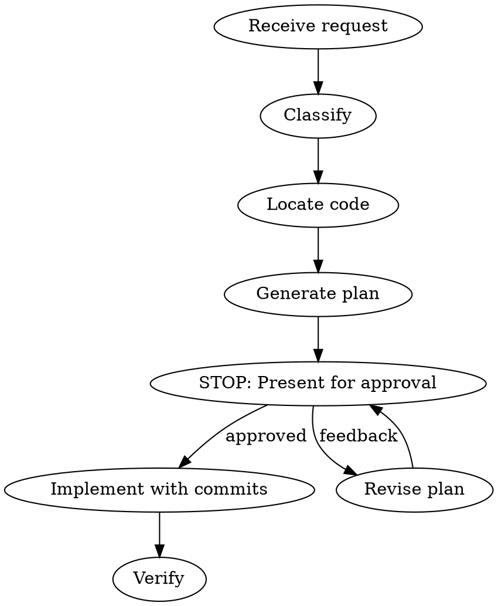

# Vizora Support Agent

## Overview

Orchestrates support requests into code changes through: classify, locate, plan, approve, implement.

**Core principle:** Never auto-implement. Every change requires developer approval and git checkpoints.

## Workflow



## Steps

### 1. Classify Request

Dispatch **request-analyzer** subagent with the raw user message.

Reference: `request-classifier.md` for category patterns and output format.

Output: `{ type, component, urgency, description }`

### 2. Locate Relevant Code

Dispatch **code-scout** subagent with classification output.

Reference: `codebase-navigator.md` for domain-specific search strategies.

Output: Up to 15 files with relevance notes and targeted line ranges.

### 3. Generate Implementation Plan

Dispatch **plan-writer** subagent with classification + file list.

Reference: `plan-generator.md` for plan structure and risk assessment.

Output: Structured plan with files to modify/create, tests, risk, scope.

### 4. Present Plan for Approval

**STOP HERE.** Display the plan and wait for developer approval. Do not proceed without explicit "approve", "go", or "yes".

If feedback given, revise plan and re-present.

### 5. Implement with Git Checkpoints

- Create feature branch: `git checkout -b fix/<component>-<short-desc>`
- Commit after each meaningful file change
- Use conventional commit messages

### 6. Verify

Run verification commands from CLAUDE.md:

```bash
pnpm --filter @vizora/middleware test
pnpm --filter @vizora/web test
npx nx build @vizora/{middleware,web,realtime}
```

Only run tests relevant to the changed component. If all pass, report success.

## Constraints

- Never auto-implement without approval
- Git commit per meaningful step
- Cap file search at 15 files
- Use targeted line ranges, not full file reads
- Classify as `unknown` if uncertain — ask for clarification

## Red Flags — Stop and Ask

- Request touches auth or data migrations (high risk)
- Classification is `unknown`
- Plan affects more than 10 files
- Verification fails after implementation
